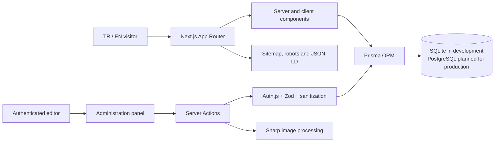
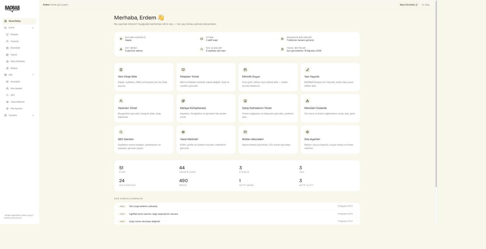
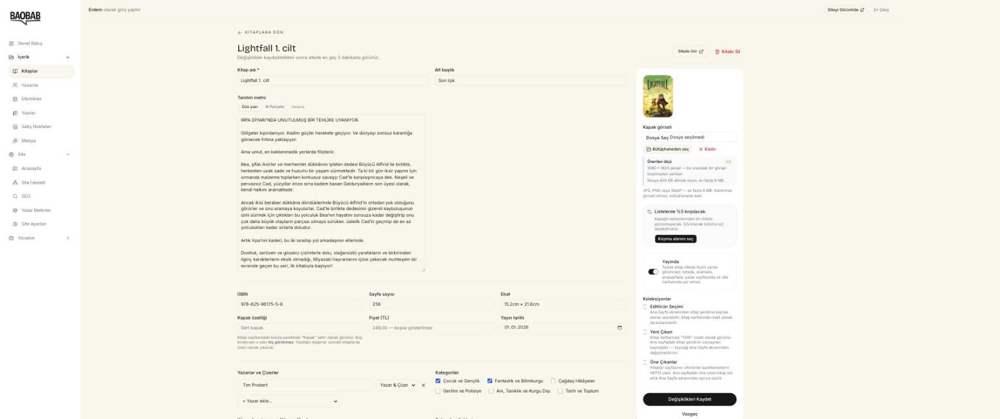
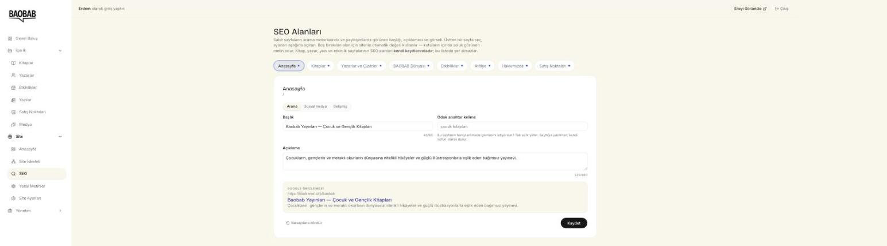

# BAOBAB — Bilingual Publishing Platform

> A code-free case study of a bilingual publishing website and editorial
> management platform. Proprietary source, credentials, and unpublished client
> material are intentionally excluded.

[Türkçe sürüm](README.tr.md) · [Architecture](docs/ARCHITECTURE.md) · [Feature map](docs/FEATURE-MAP.md)

## Overview

BAOBAB is a Turkish and English publishing platform that combines a public
catalog and editorial website with a custom administration panel. It manages
books, authors, previews, events, articles, sales points, media, subscribers,
homepage composition, and site-wide settings.

| Area | Detail |
|---|---|
| Status | Advanced development; production launch preparation remains |
| Role | End-to-end product, architecture, and development ownership |
| Product type | Bilingual public website and private content platform |
| Content model | 14 connected data models with separate TR/EN fields |
| Public scope | Case study only; application source remains private |

## The Product Need

A publishing website needs more than static book pages. Editors must be able
to connect books with authors, organize previews, publish articles and events,
manage media, update sales points, and maintain two languages without editing
code.

The system was designed around those editorial relationships rather than as a
collection of unrelated pages.

## My Role

- owned the full product and development workflow;
- translated publishing requirements into content models and admin flows;
- designed the bilingual routing and content strategy;
- implemented and reviewed public pages, server-side operations, and panel modules;
- prepared the Linux, Nginx, and PM2 staging environment;
- iterated on the product through stakeholder review and revision cycles.

## Public Experience

- Bilingual Turkish and English routes
- Homepage with managed hero slides and content sections
- Book catalog and detailed book pages
- Interactive “pages from the book” preview
- Author list and profile pages
- Editorial articles, events, workshops, and sales points
- Site search and newsletter registration
- Privacy, data-protection, and terms pages
- Sitemap, robots directives, JSON-LD, and structured SEO support

## Administration Experience

- Dashboard and hero-slider management
- Books, categories, previews, and author relationships
- Authors, events, articles, and sales points
- Central media library with search and trash workflow
- Newsletter subscribers with CSV export
- Turkish and English content fields
- Site settings, account management, theme support, and section ordering

## Key Engineering Challenge

### One editorial model, two complete languages

The main challenge was making multilingual content a first-class part of the
data model rather than translating only interface labels.

Books, authors, events, articles, hero slides, and site sections carry separate
Turkish and English content. Public routes are locale-aware, while the admin
panel lets editors manage both versions within the same workflow. Missing or
incomplete translations can therefore be handled deliberately instead of
producing inconsistent pages.

## Architecture

See [Architecture](docs/ARCHITECTURE.md) for the editorial and deployment
boundaries.

## Technology Stack

| Layer | Technologies |
|---|---|
| Application | Next.js 16, React 19, TypeScript |
| Interface | Tailwind CSS 4, shadcn/ui, Motion, next-themes, Lucide |
| Content UX | Tiptap editor, react-pageflip, Sonner |
| Server | Server Components, Server Actions, Auth.js v5, Zod, sanitize-html |
| Data | Prisma 7, SQLite for development/testing, PostgreSQL planned for production |
| Media | Sharp and a central media model |
| Internationalization | next-intl with `/tr` and `/en` routes |
| Infrastructure | Linux, Nginx, PM2 |

## Deliberate Scope Boundaries

- The current product is a catalog and editorial platform, not an online checkout.
- Book records can point to external stores and sales locations.
- Commerce-ready fields exist in the model, but cart and payment flows are not presented as completed work.
- Production launch depends on analytics identifiers, domain/infrastructure access, and legal-content review.

## Interface

### Editorial dashboard

The administration entry point is organised around tasks rather than tables:
add a book, publish an article, announce an event, manage retail points. The
counters underneath report the live catalogue — 51 books, 44 authors and
illustrators, 24 retail points and 490 media assets at the time of capture.

### Book editor

One record combines catalogue metadata (ISBN, page count, physical dimensions,
cover type, price, publication date), a rich-text description, contributors with
explicit roles, categories, credits, and collection membership — plus a cover
uploader that states the expected dimensions and lets the editor choose the crop
region used in listings.

### Per-page SEO

SEO is a first-class editing surface rather than an afterthought. Every fixed
page carries its own title, focus keyword and description with live character
counters against the limits search engines actually apply, and a rendered
preview of the resulting search result. Empty fields fall back to the site
defaults instead of shipping blank tags.

## Outcome

Most planned website and administration capabilities are implemented. The
remaining work is concentrated around release preparation, analytics,
production infrastructure, and final stakeholder/legal approvals.

The project demonstrates my experience with content modeling, multilingual
architecture, authenticated administration, media workflows, SEO, deployment
preparation, and iterative product development.

## Repository Purpose

This repository presents the engineering work without publishing proprietary
application code or unpublished client content. It contains no production
secrets and is not a deployable copy of the platform.
