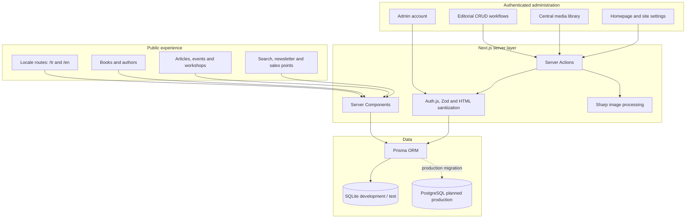
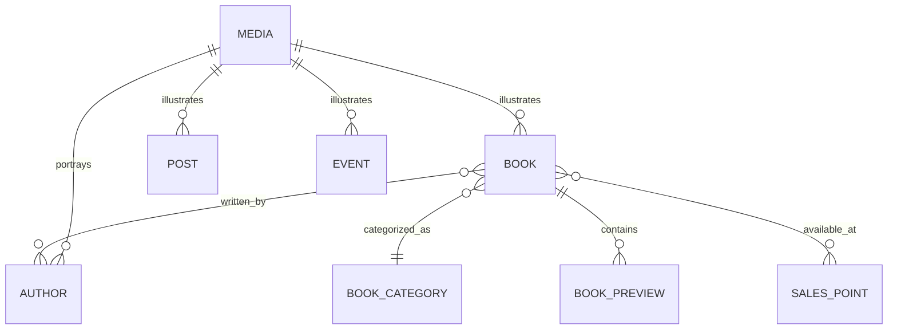

# BAOBAB Architecture

## Component View

## Main Content Relationships

The production schema contains additional models for homepage composition,
newsletter subscribers, site settings, hero slides, and administrator access.

## Internationalization Strategy

- Turkish is the default locale.
- Public content is routed under explicit `/tr` and `/en` paths.
- Editorial models contain separate Turkish and English content fields.
- Editors manage both language versions in one administration workflow.
- SEO metadata and structured data are generated for locale-aware pages.

## Editorial Safety

- Rich-text content is validated and sanitized on the server.
- Administrative access uses authenticated sessions and password hashing.
- Media is processed centrally rather than being handled independently by each page.
- Public source, unpublished content, and production credentials are excluded from this case study.

## Deployment Boundary

The application has a Linux/Nginx/PM2 staging path. Production release is kept
separate from application completion because it depends on external analytics,
domain, infrastructure, database, and legal-content approvals.
